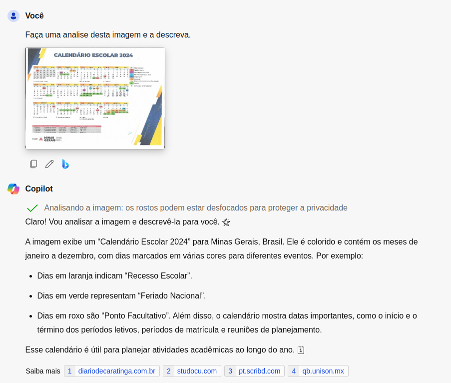
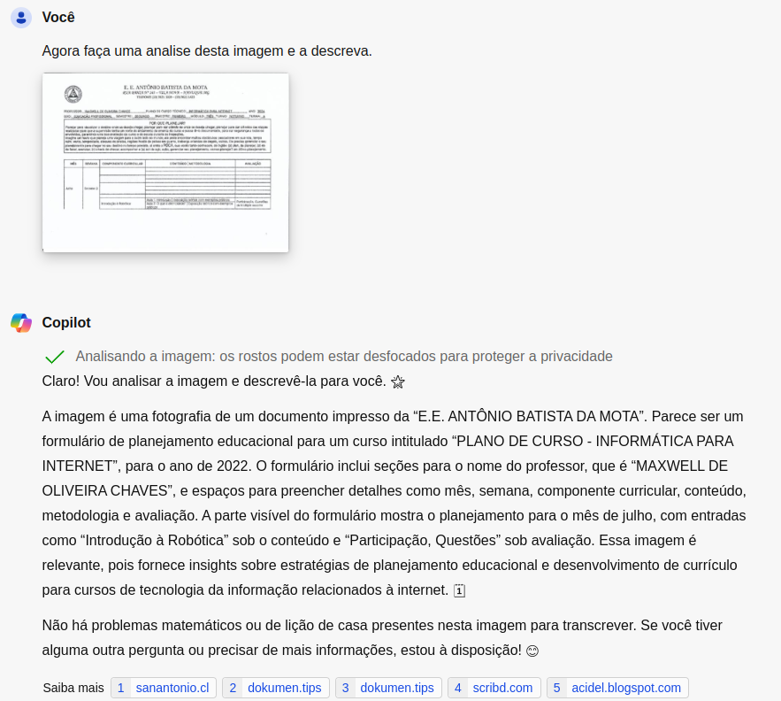

# Desafio Copilot

Este repositório contém um projeto desenvolvido como parte de um desafio para demonstrar a utilização do Copilot para análise de imagens e descrição das mesmas em forma de texto.

## Estrutura do Projeto

- **inputs/**: Contém as imagens utilizadas para o reconhecimento de texto.
- **output/**: Armazena os resultados do processo de reconhecimento de texto aplicado às imagens da pasta `inputs`.

